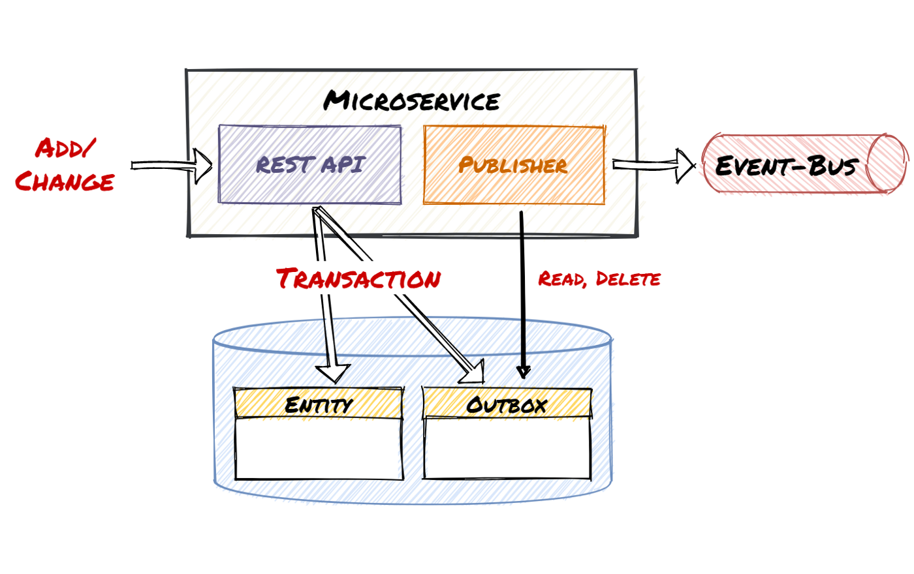

# Outbox Pattern

## Problem

Event sourcing is a common architecture for different microservices to interact with each other through events. Each
involved microservice will update its own database and publish an event for the other microservices to continue.

The problem is that the database update and the event publishment are not guaranteed to be successful. If one succeeds
and the other fails, the whole system will be left in an inconsistent state.

For example, a customer checking out the cart will involve...

1. the _Product_ service to reserve the ordered items
2. the _Order_ service to generate the receipt

An intuitive solution is to have the _Product_ service to complete the transaction first, and publish the event about
the reservation.

```elixir
{:ok, _} =
  Repo.transaction(fn ->
    Product.reserve!(checkout.items)
  end)

Event.publish!("product.reserved", checkout)
```

This implementation ensures that `checkout.items` will be reserved. However, `Event.publish!/2` could fail and the _Order_
service will not be able to continue.

One might suggest the following tweak to include the event publishment inside the transaction.

```elixir
{:ok, _} =
  Repo.transaction(fn ->
    Product.reserve!(checkout.items)
    Event.publish!("product.reserverd", checkout)
  end)
```

This makes sure that the transaction will rollback when the event fails to publish. The solution could cause another
problem unfortunately. What if the transaction fails to commit _after_ the event publishment? While the transaction will
rollback, the event publishment cannot. The _Order_ service will then generate the receipt without the checkout items
being reserved.

## Solution

We expect the whole operation to be atomic - we need a solution to guarantee that the database update and the event
publishment are both done or both aborted. Here comes the Outbox Pattern.



Instead of publishing the event synchronously, we can...

1. store the event in an **`outbox`** table within the database transaction

   ```elixir
   Repo.transaction(fn ->
     Product.reserve!(checkout.items)

     Outbox.insert!(%Outbox.Message{
       name: "product.reserved",
       data: checkout
     })
   end)
   ```

2. setup a **publisher** to poll the `outbox` table and publish the events in the _background_

   ```elixir
   outbox_messages = Outbox.poll()

   for message <- outbox_messages do
     Event.publish!(message.name, message.data)
     Outbox.delete!(message)
   end
   ```

Since the `outbox` table resides in the same database, the transaction ensures that the reservation of the checkout
items and the insertion of the outbox message will either be both committed or both rolled back.

At the same time, the background publisher will publish the outbox messages periodically, and **retry** on failure. This
guarantees that the event will be published for other microservices to consume.

## Concerns

### Event Duplication

The outbox pattern guarantees at-least-once delivery, which means that the same event can be published more than once.
Other solutions (e.g. idempotent processor, exactly-once delivery, etc.) might be required to resolve the duplication.

### Real-time Requirement

Polling the `outbox` table will introduce a latency to the processing pipeline. If you have a real-time requirement, you
might consider _transaction log tailing_ to process the messages as soon as they are committed to the `outbox` table.

## References

1. [Transactional Outbox Pattern](https://ioannisioannou.me/transactional-outbox-pattern/)
2. [The Outbox Pattern in Event-Driven ASP.NET Core Microservice Architectures](https://itnext.io/the-outbox-pattern-in-event-driven-asp-net-core-microservice-architectures-10b8d9923885)
